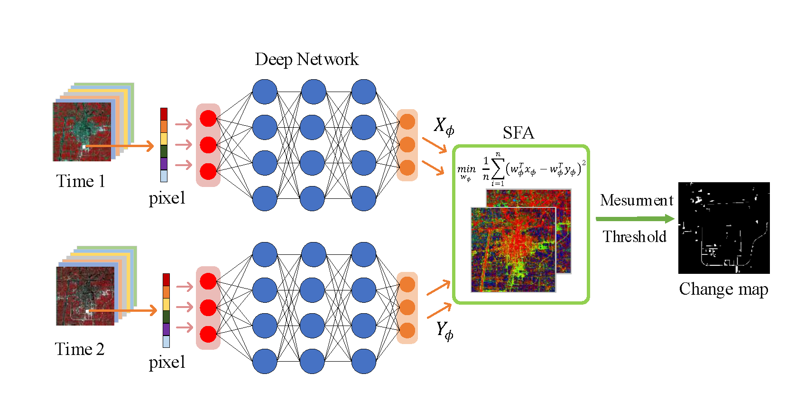
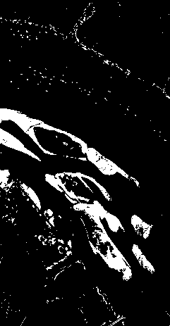
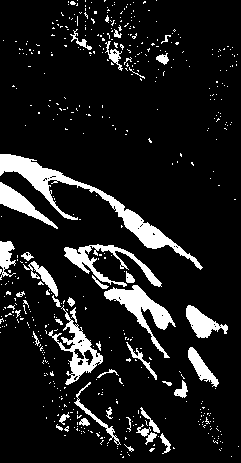

# DSFANet (Deep Slow Feature Analysis Network)
Tnesorflow implementation for [Unsupervised Deep Slow Feature Analysis for Change Detection in Multi-Temporal Remote Sensing Images.](https://arxiv.org/abs/1812.00645)



## Abstract
In this paper, based on deep network and slow feature analysis (SFA) theory, we proposed a new change detection algorithm for multi-temporal remotes sensing images called Deep Slow Feature Analysis (DSFA). In DSFA model, two symmetric deep networks are utilized for projecting the input data of bi-temporal imagery. Then, the SFA module is deployed to suppress the unchanged components and highlight the changed components of the transformed features. The CVA pre-detection is employed to find unchanged pixels with high confidence as training samples. Finally, the change intensity is calculated with chi-square distance and the changes are determined by threshold algorithms. The experiments are performed on two real-world datasets and a public hyperspectral dataset. The visual comparison and quantitative evaluation have both shown that DSFA could outperform the other state-of-the-art algorithms, including other SFA-based and deep learning methods.


## Requirements

```
tensorflow_gpu==1.7.0
scipy==1.0.0
numpy==1.14.0
matplotlib==2.1.2
```

## Usage
### Download data
- [DOWNLOAD DATA](https://pan.baidu.com/s/1I_1o7RePylgjzxAPXZ6BMA).
- Note: This dataset was firstly provided in [GETNET: A General End-to-end Two-dimensional CNN Framework for Hyperspectral Image Change Detection](https://arxiv.org/abs/1905.01662).

### Install the requirements
```
pip install -r requirements.txt
```
### Run code
```
python dsfa.py [-h] [-e EPOCH] [-l LR] [-r REG] [-t TRN] [-i ITER] [-g GPU]
               [--area AREA]
```
```
optional arguments:
  -h, --help              show this help message and exit
  -e EPOCH, --epoch EPOCH epoches
  -l LR, --lr LR          learning rate
  -r REG, --reg REG       regularization parameter
  -t TRN, --trn TRN       number of training samples
  -i ITER, --iter ITER    max iteration
  -g GPU, --gpu GPU       GPU ID
  --area AREA             datasets

```
### Results
<center>

|  Our Results   | Reference Image  |
|  :----:  | :----:  |
|   |  |
</center>

## Citation
Please cite our paper if you use this code in your research.
```
@article{Du2019Unsupervised,
  author={B. {Du} and L. {Ru} and C. {Wu} and L. {Zhang}},
  journal={IEEE Transactions on Geoscience and Remote Sensing},
  title={Unsupervised Deep Slow Feature Analysis for Change Detection in Multi-Temporal Remote Sensing Images},
  year={2019},
  volume={57},
  number={12},
  pages={9976-9992},
  doi={10.1109/TGRS.2019.2930682},
  ISSN={1558-0644},
  month={Dec},
}
```

## Q & A
**For any questions, please [contact us.](mailto:rulixiang@outlook.com)**
